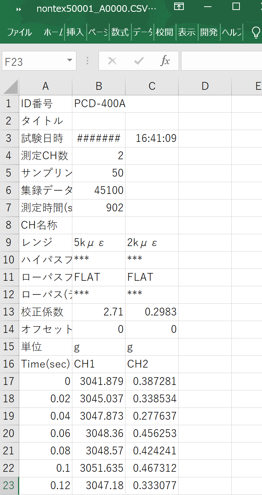
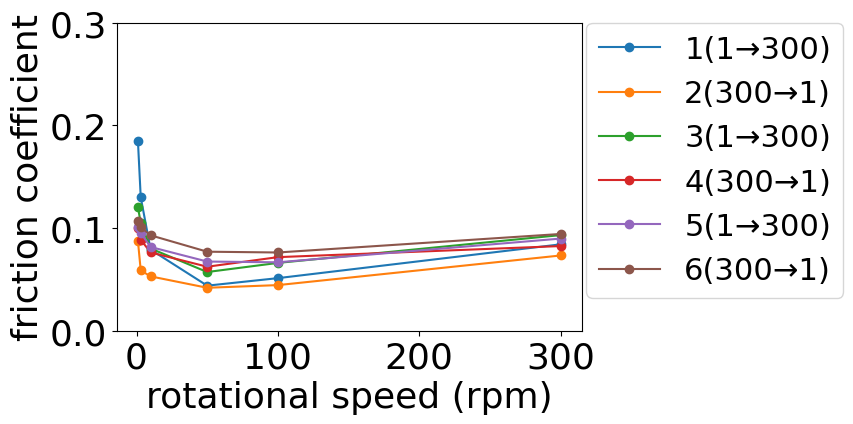
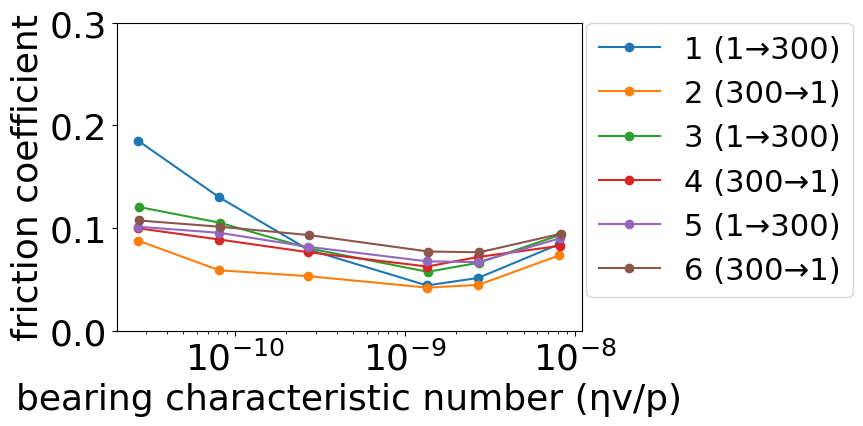

# CSV data processing
Process the csv data recorded by the load cell data logger, and save it to excel files and png files(as graphs)

1. Process the original data of load and friction force over time.
2. Create time lapse data of friction coefficient.
3. Calculate the average friction coefficient for each speed.
4. Calculate the bearing constants to create Stribeck curve.
5. Save each data in xlsx files, create graphs and save them in png files.

## DEMO

|**Input**|**Output**||
|:---:|:---:|:---:|
|**csv**|**sliding-friction_png**|**stribeck-friction_png**|
||||
